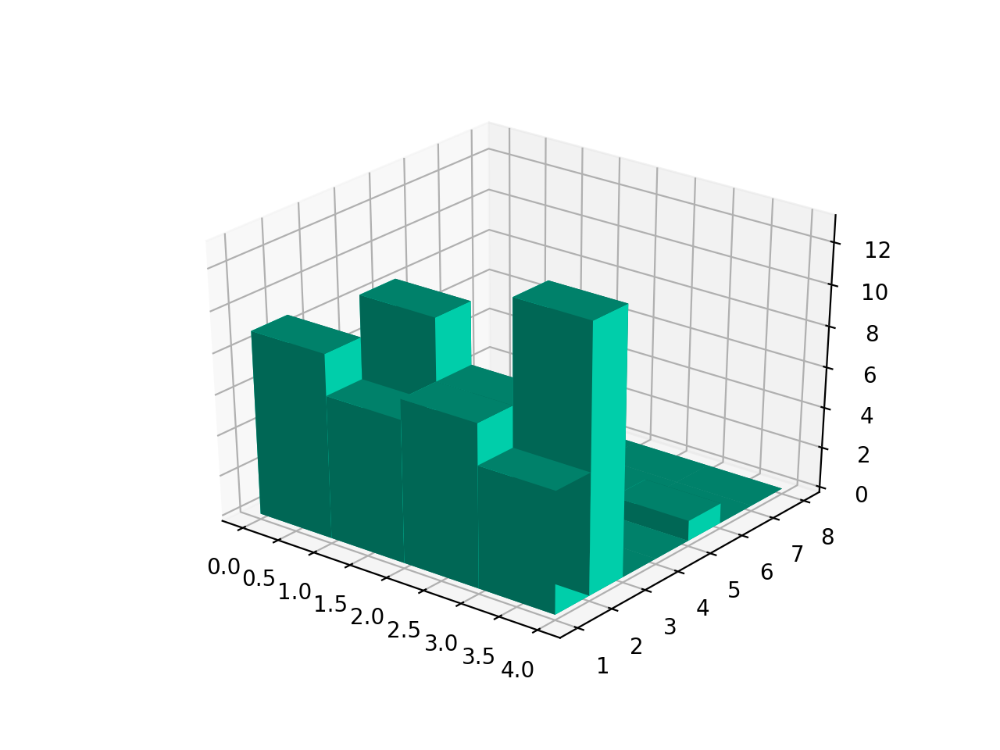

# Introduction

 This documentation describes how to run and use the Python implementation of the CORVIDS data recovery system. Please see the accompanying paper for the details of the implementation.

The CORVIDS system reconstructs Likert-scale type data, in which every possible value is an integer on a restricted scale, from the sample size, scale limits, mean, and standard deviation. This software will return all possible solutions when they exist, and is capable of exploring the solution space graphically and by testing whether certain values are possible, or whether certain ranges of values are required for solutions.

These operations can be quite computationally intensive. By default, the code runs in multi-process mode to speed up runtime.

#Using the GUI

If you download the compiled version of the program, it runs with a GUI interface.

##Recreating data from summary statistics

If you have values you would like to recreate data for, simply enter them in the relevant fields.

###Minimum value
`Minimum value` is the smallest possible value on the scale. For a 1 - 7 scale, the value to enter would be 1.

###Maximum value
`Maximum value` is the largest possible value on the scale. For a 1 - 7 scale, the value to enter would be 7.

###Mean
`Mean` is the mean (arithmetic average) value of the responses in the data set. It may be entered as a single number or as a mathematical formula (e.g. (5 + 6 + 3 + 1)/4).

###Mean precision
`Mean precision` is the tolerance up to which the program will search for viable means. For instance, entering a mean of 1.5 with a tolerance of 0.1 will cause the program to search all viable values between 1.4 and 1.6. This is useful for getting around issues with rounding, but be aware that a large precision value can add to runtime.

###Variance
`Variance` is the variance of the dataset. It may be entered as a single number or a mathematical formula. CORVIDS assumes that the variance was calculated according to the [unbiased sample variance](http://mathworld.wolfram.com/SampleVariance.html), the default for most statistical software (including R).

###Variance precision 
`Variance precision` is the tolerance up to which the program will search for viable variances. For instance, entering a variance of 1.55 with a tolerance of 0.01 will cause the program to search all viable values between 1.54 and 1.56. This is useful for accounting for rounding, but be aware that a large precision value can add to runtime.

###Standard deviation
`Standard deviation` is the standard deviation of the sample. It may be entered as a single number or a mathematical formula. CORVIDS assumes that the variance was calculated according to the [unbiased sample standard deviation](https://en.wikipedia.org/wiki/Unbiased_estimation_of_standard_deviation), the default for most statistical software (including R).

###Standard deviation precision
`Standard deviation precision` is the tolerance up to which the program will search for viable standard deviations. For instance, entering a standard deviation of 1.55 with a tolerance of 0.01 will cause the program to search all viable values between 1.54 and 1.56. This is useful for accounting for rounding, but be aware that a large precision value can add to runtime.

###Number of subjects
`Number of subjects` is the number of subjects in the sample, or the number of cases or measurements if there's only one subject.

##Scale format
*Note:* This program assumes that you are using an integer scale that spans the minimum to maximum value in steps of size 1. If you have a non-integer scale, you will have to transform the data onto an integer space.

For example, if your scale ranges from 0 to 10 but accepts quarter-values (so 4.75 is a valid choice), then the following steps should be taken:

* Multiply the scale ends and all of its values by 4 so that the new, transformed scale range is 0 to 40
* Multiply the mean and the mean precision by 4 (or the reciprocal of whatever fraction the scale accepts)
* Multipy the variance and the variance precision by 4^2^ (16)

So for a 0 to 10 scale with a mean of 4.725 and a variance of 6.12 for 20 subjects, you would enter the following values: 

* `Minimum value`: 0  
* `Maximum value`: 40  
* `Mean`: 18.9  
* `Mean Precision`: 0.004  
* `Variance`: 97.92  
* `Variance Precision`: 0.16  
* `Number of Subjects`: 20  

The data returned should then be divided by 4 to recover the original, non-integer values.

##Specifying output and value restrictions

There are two global parameters you can toggle on or off: `Print Progress`, in the top-left, determines whether status updates and progress is printed in the output pane. It's encouraged to leave this on.

The program will print the first 100 solutions to the output pane. If multiple values within the set tolerance result in positive solutions, it will print those values underneath the particular mean and variance they correspond to.

**NB:** CORVIDS always displays the mean and **variance** for which it found solutions, even if you entered standard deviation. To convert to standard deviation, take the square root of the variance.

###Stop after first solution
`Stop After First Solution`, if checked, causes the program to return the first solution that it finds, if such a solution exists. This is useful if you are only interested in determining whether a given set of statistics is possible, rather than interested in getting every possible solution.

###Possible values
The `Possible Values` pane lists the values of the scale that are allowed to be in the solutions. By default, this will be all integer values between `minimum value` and `maximum value`. However, if you are interested in exploring the solution space, or testing whether solutions continue to exist if you restrict the scale, you can delete values and re-run the analysis. For instance, you could require solutions to lie between 2 and 6 instead of 1 and 7, if you want to see whether the data can exist without the extreme values on the scale.

###Forced values
Similarly, the `Forced Values` pane takes text entry, and allows you to specify any values that are required to be in the solution space. CORVIDS will then only return solutions that contain at least one instance of the required value(s) if only one number is entered. To force at least n instances of a particular value, simply enter n values into the `Forced Values` pane.

**Note:** When values are forced to appear in solutions, the program holds them constant. It will thus suggest that it is looking for solutions at a different mean and standard deviation/variance than what was entered, because it's solving the remainder of the values. The resulting solutions will satisfy the original mean and standard deviation that was entered.

If you attempt to force a value outside of your entered scale, the program will run and attempt to find a solution with that value. It does not check that the forced values fall within the scale range.

If a value is removed from the `Possible Values` and then subsequently entered into the `Forced Values` pane, the program will find solutions with one instance of the value.

For both `Possible Values` and `Forced Values`, input should be integers separated by spaces or commas. Strings, decimals, and other degenerate inputs are ignored.

##Saving results and loading previous results

There are five different options under the `File` menu.

###Load settings
`Load settings` allows you to load in previously settings saved to an .rd file (`minimum value`, `maximum value`, `possible values`, `forced values`, etc.) so that you don't have to enter them again. Simply click `Browse`, navigate to the correct file, select it, then click `OK` to load.

###Save settings
`Save settings` saves the current settings to an .rd file.

###Load model
`Load model` is much like `Load settings`, except it loads a previously saved .rd model (settings + solutions).

###Save model
`Save model` saves not only the settings, but also the solutions to a .rd file.

###Save data
`Save data` saves all the solutions to a .rd file. Solutions are saved with the mean and variance that generated the solution, followed by the solution in list form. For example, `[1, 1, 2, 3, 3, 4]` means that one possible solution has two subjects responding `1`, one subject responding `2`, two subjects responding `3`, and one subject responding `4`.

#Using the source

##Requirements

[SymPy](http://www.sympy.org/en/index.html)  
[NumPy](http://www.numpy.org/)  
[matplotlib](https://matplotlib.org/)  

##Files contained in this package

`RecreateData.py` is the only file you'll need to interact with. It contains the class `RecreateData` and methods for generating and manipulating solutions.

`diophantine.py` is a reimplementation of the `diophantine` package for Python under the MIT license. Provides functions used for solving diophantine equations.

`findSolutionsWithManipBasis.py` contains the functions used to generate the complete solution space from the initial solution and the basis returned by the diophantine equation solver.

`basisManipSolutions.py` implements several functions required to comprehensively search the solution space.

`GUIMisc.py` implements functions required to support the GUI for the program.

##Use

These files are intended to be used as an API, rather than run directly; external scripts should import and call their methods.

`RecreateDataGUI.py`, if run, provides all the same functionality as `RecreateData.py`, but provides a user interface with which to interact with the program.

All of the critical features can be accessed by initiating and using a `RecreateData` object. This class accepts the following arguments:

* `min_score` is an integer representing the low end of the scale; it would be 1 for a 1 to 7 scale.
* `max_score` is an interger representing the high end of the scale; it would be 7 for a 1 to 7 scale.
* `num_samples` is the sample size of the data. If 40 subjects took the survey, that's the value to pass.
* `mean` is the mean of the sample. This value may be a decimal value, such as 4.5, or a mathematical formula, such as $45/15$.
* `variance` is the variance of the sample. This value may be a decimal value, such as 4.5, or a mathematical formula, such as $45/15$.
* `debug` is an optional argument indicating whether the code should be run in debug mode; if so, additional messages will be printed.
* `mean_precision` is an optional argument that determines whether the function should search a range of values around the value passed as `mean`. If specified, the function will attempt to find solutions for all valid means contained in the interval of `mean` $\pm$ `mean_precision`. This is useful if the value you are checking was not reported to a sufficient level of precision. Defaults to 0.0.
* `variance_precision` is an optional argument that determines whether the function should search a range of values around the value passed as `variance`. If specified, the function will attempt to find solutions for all valid variances contained in the interval of `variance` $\pm$ `variance_precision`. This is useful if the value you are checking was not reported to a sufficient level of precision, or that have undergone too much rounding. Defaults to 0.0.

**Note:** If both `mean_precision` and `variance_precision` are specified, the function will try every possible combination of valid means and variances. This can increase runtime.

To recreate values once the RecreateData object is initialzied, simply call the `recreateData` method. 

```{python eval=FALSE}
from RecreateData import *

rd = new RecreateData(min_score=1, max_score=7, num_samples=20, mean=4, variance=2)
rd.recreateData()
```

The solutions can then be accessed via one of two methods. The `rd.sols` attribute stores solutions in a set in which each element is a list representing the number of subjects at each response level in the scale. For example, the solution `[4, 3, 2, 3, 0, 5, 3]` indicates that 4 subjects responded with 1, 3 with 2, and so on. Along with the solutions, the mean and variance is returned (in the case where multiple values for the mean and variance were tested). **NB:** If the possible values are restricted, any values which are excluded **will not appear** in the output produced by `rd.sols`. For example, if the scale spans from 1 to 7 and the values 4 and 5 are held out (so only 1, 2, 3, 6, and 7 are possible in the output), then the solution `[2, 1, 1, 3, 2]` would correspond to two 1s, one 2, one 3, three 6s, and two 7s.

The `rd.getDataSimple()` method returns solutions not as counts of values, but of the individual values themselves. For example, whereas `rd.sols` would give `[4, 3, 2, 3, 0, 5, 3]`, this method would return `[1, 1, 1, 1, 2, 2, 2, 3, 3, 4, 4, 4, 6, 6, 6, 6, 6, 7, 7, 7]`.

`recreateData` accepts three optional arguments.

* `check_val`, if specified, requires that the solutions contain the specified integer(s). If an integer is passed, all solutions returned will be those with one subject allocated to the specified integer. If a list is passed, a subject will be allocated to each integer in the list. A dictionary may also be passed, of the form `{scale_value:number_of_respondents}`, in which case the specified number of subjects will be allocated to each specified scale value. Defaults to `None`.
```{python eval=FALSE}
rd.recreateData(check_val=4)
#These are equivalent calls
rd.recreateData(check_val=[4, 4, 6, 6, 6])
rd.recreateData(check_val={4:2, 6:3})
```

* `poss_vals` is an optional argument specifying what parts of the scale are to be allowed in the solutions, passed as any iterable. This is valuable for exploring whether solutions can still exist if, for example, there are no responses at either end of the scale. All solutions returned, if they exist, will conform to the scale specified. Defaults to `None`.
```{python eval=FALSE}
rd.recreateData(poss_vals=[2, 3, 4, 5, 6])
```

The `recreateData` method also takes an optional argument `find_first`. If this is set to `True`, the program will return the first solution it finds and then stop. This is useful if you are simply interested in whether data are possible, and don't need the full solution set.

* `multiprocess` is an optional argument indicating whether the code should be run on multiple processes. Defaults to `True`.

Once the solution space has been returned, there are two additional methods that can be called.
* `analyzeSkew` iterates over every solution in the solution space and calculates its skew, returning a list of skews, the mean skewness, and the standard deviation of the skewness. A perfect normal distribution has 0 skew. Skew > 0 indicates positive skew (more weight in the left tail) and skew < 0 indicates negative skew (more weight in the right tail).
```{python eval=FALSE}
rd.analyzeSkew()
```

* `graphData(max_samples=40)` creates a 3D histogram of the solution space, plotting `max_samples` number of solutions. For the sake of runtime, this argument defaults to 40, as this process can be extremely slow for large solution spaces.

```{python eval=FALSE}
rd.graphData()
```


#Usage notes

##The precision argument

Giving the program some tolerance will help it find the precise variance and mean value it needs. Any time there is precision loss, which will be any time a value rather than a mathematical formula is entered for variance, add tolerance. If not enough precision is allowed, the program will not be able to find otherwise valid solutions to the numbers given. 

##Runtime 

The larger the range of the scale and the more subjects there are, the longer the program will take to run. For a particularly large number of solutions or many combinations of means and variances to test, this could mean a considerable waiting period. 

##Opening the help docs

If you are using a Mac and your default web browser is Chrome, you will notice that the docs do not open in Chrome, but instead in another browser. There is a bug in Chrome with Mac OSX High Sierra that prevents files from opening in the browser, if Chrome is already running. This is a work-around so that the docs will still open.
